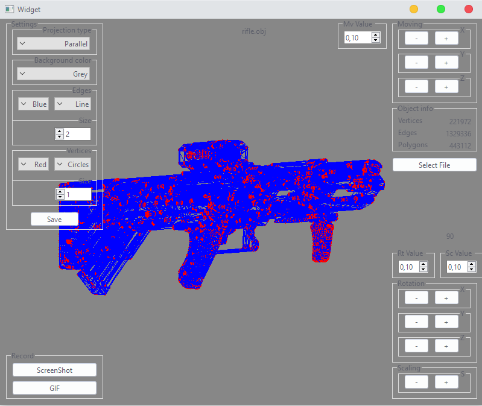
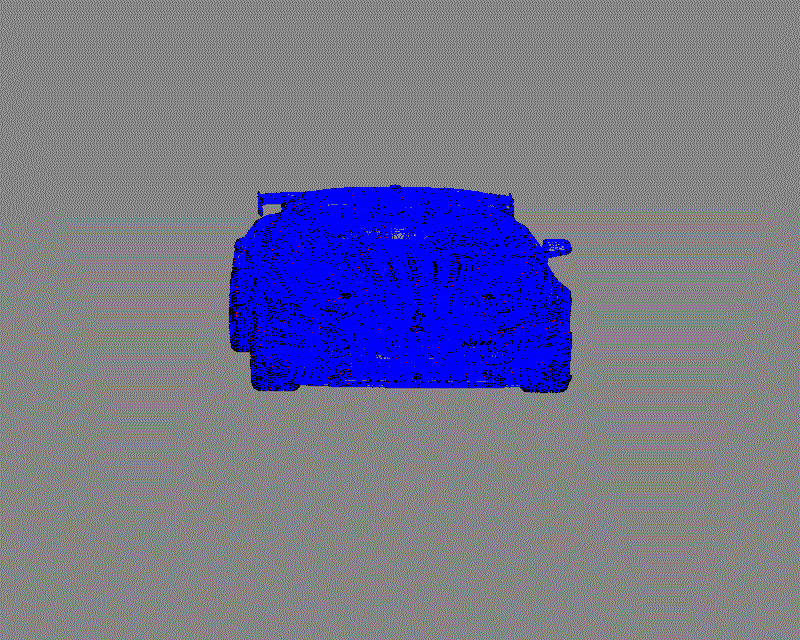
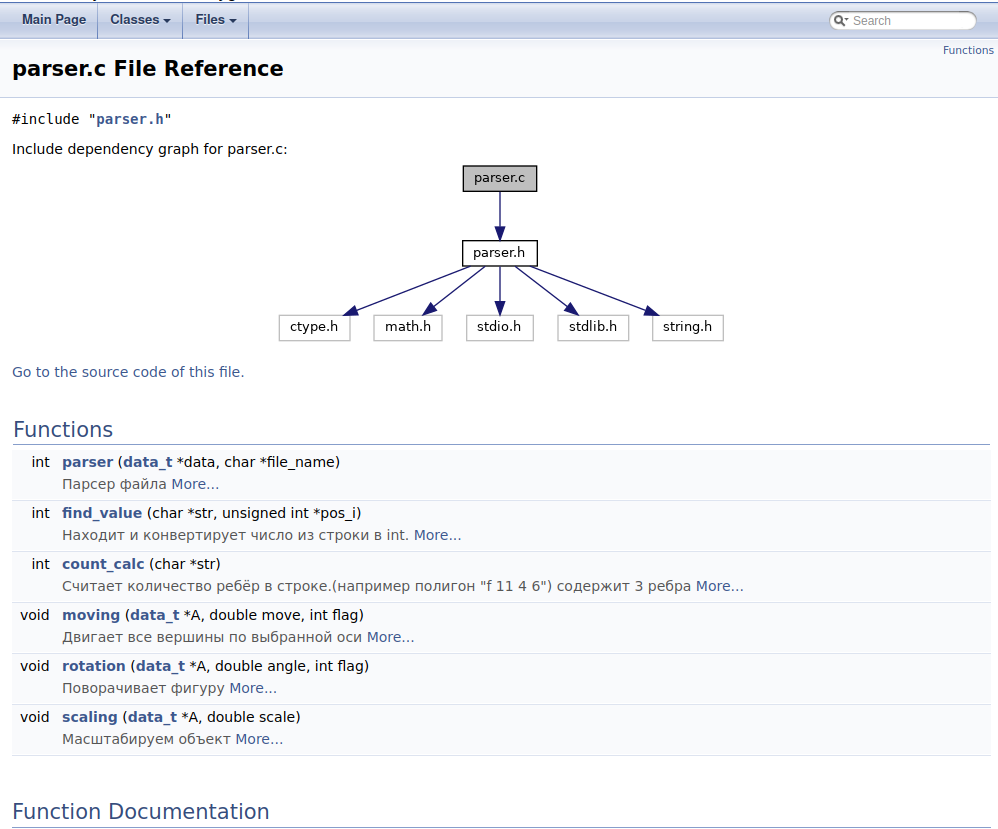

# 3DViewer_v1

### Реализация программы для просмотра 3D моделей в каркасном виде (3D Viewer) на языке С и GUI с помощью QT.

#### Installation:
Сборка проекта с помощью [Makefile](https://github.com/GTimsan/3DViewer_v1/blob/main/src/Makefile) и нужной цели.

#### Navigation
Тесты и вычислительная часть написанная на языке Си:
- [Тесты](https://github.com/GTimsan/3DViewer_v1/blob/main/src/tests.c)
- [Header](https://github.com/GTimsan/3DViewer_v1/blob/main/src/parser.h)
- [Реализация](https://github.com/GTimsan/3DViewer_v1/blob/main/src/parser.c)

#### Description:
GUI интерфейс с возможностью сохранения настроек, созданием GIF-ок:  

Пример записи GIF:  

Документация сгенерирована с помощью doxygen:

